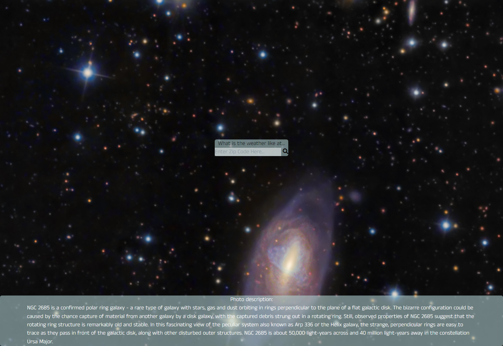

# The Nasa Spirit
This project is a website that allows the end user to obtain the current weather for a location while also retrieving data related to the moon phase and how clear the sky is at that given moment. 

Two APIs are utilized for this application: NASA's Picture of the Day API and Visual Crossing's Weather API.

 # Sample of Deployed Application
# 

# Source: https://aubree-alexander.github.io/the-nasa-spirit/
# Website Link: https://aubree-alexander.github.io/the-nasa-spirit/

# API Sources

<a href="https://github.com/nasa/apod-api">NASA's Picture of the Day API</a>

<a href="https://www.visualcrossing.com/weather-api"> Visual Crossing's Weather API </a>