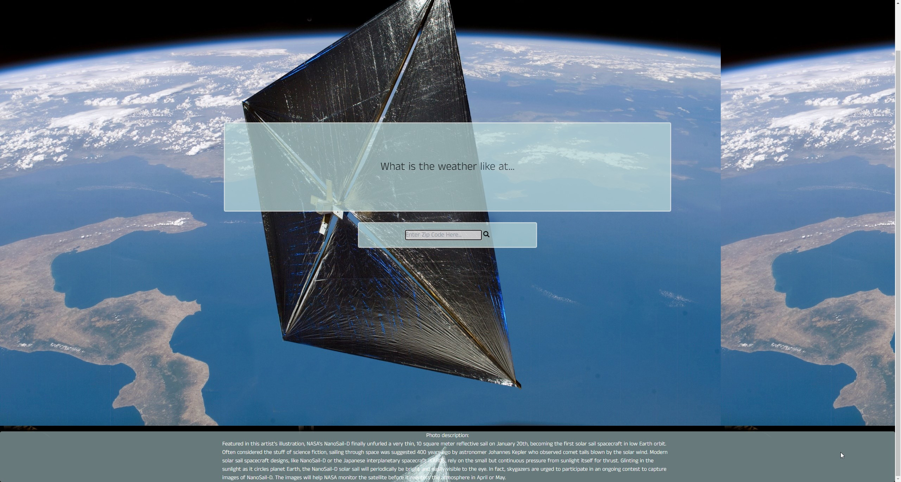
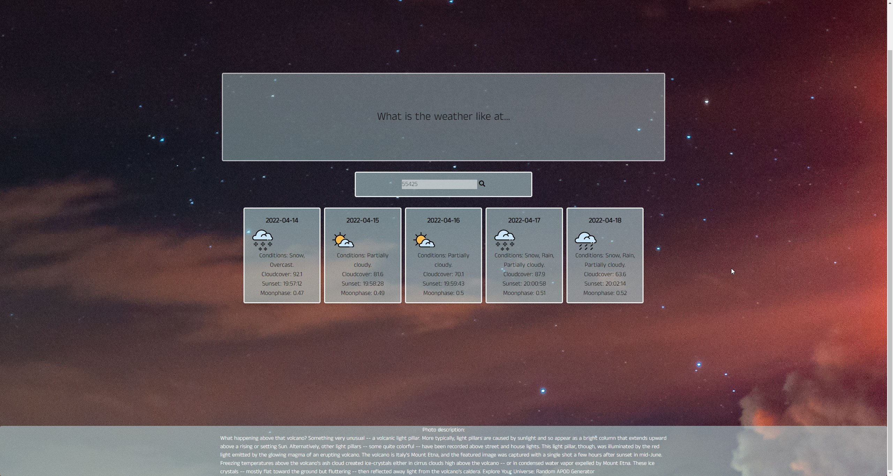

# The Nasa Spirit README
This project is a website that allows the end user to obtain the current weather for a location while also retrieving data related to the moon phase and how clear the sky is at that given moment. 

Two APIs are utilized for this application: NASA's Picture of the Day API and Visual Crossing's Weather API. By using them in tandem the end user is able to quickly ascertain stargazing conditions as well as the weather conditions.

Tailwinds was also utilized in the CSS stylings. 

 # Sample of Deployed Application
# 

The project will populated with a random POTD from NASA's API. The End User will be prompted to enter in a zip code of their choice. At the bottom of the page a description of the photo will be pulled from the API, which will allow the user to discern what is being shown on the screen.

This page will show the current weather as well as the future forcast for the area that the end user entered into the text field from the home page. 

# Important Sources

## <a href="https://aubree-alexander.github.io/the-nasa-spirit/"> Source Code </a> 

## <a href= "https://aubree-alexander.github.io/the-nasa-spirit/"> Website Link </a>

## API Credits

<a href="https://github.com/nasa/apod-api">NASA's Picture of the Day API</a>

<a href="https://www.visualcrossing.com/weather-api"> Visual Crossing's Weather API </a>